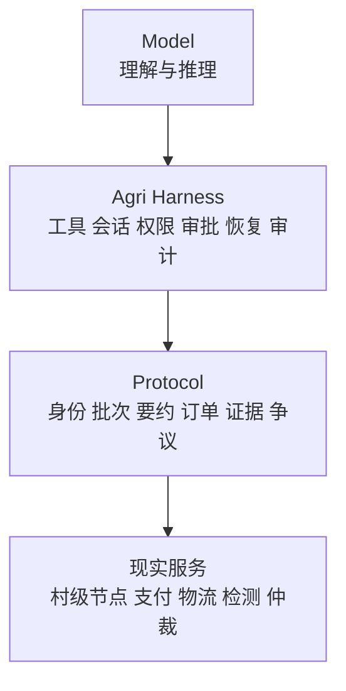

# AI原生开放助农网络白皮书

> 让第一个真实需求，在不购买流量、不交出数据主权的情况下，找到第一个真实农产品，并完成一笔真实、可追溯、可售后的交易。

## 版本说明

本文是公开评审草案，不构成已经投入生产的技术、法律或商业承诺。文中涉及的规模均为项目目标或试点假设，不代表已经实现。

本版在原行动纲领基础上完成三项修正：

1. 从“去中心化平台”改为“可竞争、可审计、可退出的市场基础设施”；
2. 从“AI代理功能”改为“模型、Harness和交易协议分层”；
3. 从“先扩节点”改为“先验证交易、经济价值、权力边界和退出能力”。

# 执行摘要

中国小农户的生产天然分散，但数字市场的入口、数据和流量高度集中。传统平台降低了搜索、支付和履约成本，同时也把商户身份、消费者关系、信誉记录和推荐权沉淀在平台内部。

本项目不试图用另一个平台取代现有平台，也不把“取消所有中间环节”当作目标。物流、支付、检测、集货和仲裁都有真实价值。问题在于，这些中间服务是否可以替换，是否因为掌握入口而成为交易的永久控制者。

白皮书提出一套由村级节点、开放交易协议和农业Agent Harness组成的技术体系：

```text
农业交易 Agent = 可替换模型 + Agri Harness + 开放交易协议
```

村级节点连接农户和现实生产过程；开放协议表达批次、要约、订单、证据和争议；Agri Harness管理模型、工具、会话、权限、审批、恢复和插件。支付、物流、检测等服务通过标准适配器接入，不成为协议唯一实现。

我们不以服务器数量判断开放性，而以退出能力判断：农户能否带走自身数据，村级节点能否更换软件，消费者能否更换AI，默认索引关闭后交易能否继续。

# 第一章 问题不是连接，而是连接权属于谁

## 1.1 平台解决了什么

中心平台通过统一商品库、搜索、推荐、支付和售后，显著降低了陌生人交易成本。它的出现并非偶然，也不能用“中间环节都是病”简单否定。

平台真正提供了四类公共能力：

- 供需发现；
- 信任与责任组织；
- 支付和物流协同；
- 争议处理。

## 1.2 平台又集中什么

当上述能力只能通过一个入口获得时，平台会同时掌握：

- 谁可以进入市场；
- 谁能够被看见；
- 什么数据可以留下；
- 信誉怎样计算；
- 买卖双方能否再次联系；
- 更换平台后历史是否归零。

因此，项目要解决的不是“有没有平台”，而是任何一个中心是否获得不可替代的控制权。

## 1.3 项目的验收问题

本项目只围绕一个可检验问题展开：

> 农户能否通过村级节点发布一个真实批次，由消费者AI跨索引发现，经人工确认完成支付、物流和售后，并在更换AI或软件后继续保留可验证记录？

如果不能，项目仍然只是换了界面的平台。

# 第二章 从去中心化转向可竞争基础设施

## 2.1 不追求没有中心

身份可能需要政府或组织核验，支付必须由合规机构完成，物流天然存在区域集散，争议也需要承担责任的裁判机制。

真正目标是权力分离：

| 角色 | 可以掌握 | 不应掌握 |
|---|---|---|
| 村级节点 | 本村身份、产地和履约协助 | 全国排序和消费者入口 |
| 索引服务 | 公开要约发现 | 农户账户、完整订单和资金 |
| AI代理 | 理解、比较和建议 | 绕过授权形成重大承诺 |
| 支付机构 | 结算与回执 | 商品推荐和信誉定义 |
| 物流服务 | 运输履约 | 农户客户关系和商品准入 |
| 仲裁机构 | 争议判断 | 日常流量和价格控制 |

## 2.2 可竞争的四项标准

- **可观察**：关键数据来源、工具调用、审批和结果能够查看；
- **可恢复**：任务中断后能够从已提交事实继续；
- **可替换**：模型、索引、插件、物流和托管可以更换；
- **可退出**：主体离开某个服务后，身份、数据和历史不被清零。

## 2.3 技术不是治理的替代品

协议公开不等于规则自动公平，数字签名不等于现实陈述真实，算法开源也不等于普通农户拥有决策权。

技术能够做的是把权限、证据、变更和退出路径写成可检查的结构，为治理提供执行基础。

# 第三章 人类基础：村级节点

## 3.1 为什么以村级节点为末梢

让每个农户独立运行服务器，既不现实，也把技术成本转移给农户。村级节点更适合作为供给侧最终技术节点：它接近农户、土地、采收、集货和售后现场。

一个村级节点可以由村官、驻村人员或经共同体认可的村级服务人员运营，但节点资产属于村级组织或明确的受托主体，不属于某一任操作员。

## 3.2 节点职责

- 帮助农户建立数字档案；
- 创建和维护商品批次；
- 见证产地、采收、称重和集货；
- 响应消费者或采购AI的结构化询价；
- 协调农户确认订单；
- 组织本地交接；
- 提供售后事实材料；
- 维护节点密钥、权限和数据导出。

## 3.3 节点边界

村级节点可以证明“谁提交了什么声明”和“某项活动是否在本村发生”，不能自动证明商品绝对安全或所有描述都真实。

节点不掌握公共索引排序，不得强制农户使用指定物流、AI或营销服务。身份撤销、收款账户修改、大额退款和严重失信声明必须经过复核。

## 3.4 防止本地权力固化

- 农户可以查看涉及自己的操作日志；
- 关键操作实行双人确认；
- 操作员变更时完成密钥轮换；
- 节点数据定期生成可恢复快照；
- 农户拥有申诉和更正路径；
- 节点软件和托管服务可以迁移。

# 第四章 技术主线：农业Agent Harness

## 4.1 为什么模型不是系统

大模型能够理解农户语音、消费者自然语言和复杂约束，但它不适合直接承担库存、支付、退款和责任判断。

同一个模型接入不同工具、权限和反馈机制，表现会完全不同。因此，真正需要建设的是模型外面的运行系统。

## 4.2 三层结构



模型可以替换，Harness保证行为受到约束，协议保证不同实现能够互相理解，现实服务承担最终责任。

## 4.3 三条记录线

交易事实、Agent执行和模型上下文必须分离。

- 交易事实以追加事件保存，是跨系统迁移的权威记录；
- Agent执行记录工具调用、审批、错误和恢复；
- 模型上下文只是临时投影，可以压缩和重建。

更换模型不改变订单，更换界面不改变凭证，删除聊天不删除交易事实。

## 4.4 Profile、Preset和Plugin

Profile决定运行环境拥有什么；Preset决定某次会话中的代理角色；Plugin提供一项可加载、可卸载的能力。

首版包含村级节点、消费者采购、公共索引和审计四类Profile，以及农户助手、村级运营、家庭采购、食堂采购和公共审计五类Preset。

支付、物流、检测、通知和模型均以插件或适配器接入。插件卸载后，其权限、监听和临时资源必须回收。

# 第五章 开放交易协议

## 5.1 最小协议对象

首版只定义八类对象：

1. `VillageNode`：村级节点；
2. `Farmer`：农户主体；
3. `ProductBatch`：商品批次；
4. `Evidence`：证据；
5. `Offer`：交易要约；
6. `Intent`：消费者意图；
7. `RecommendationReceipt`：推荐凭证；
8. `OrderEvent`：订单和履约事件。

## 5.2 批次先于商品页面

农产品交易的基本对象不是一个长期不变的商品链接，而是一批具有产地、采收时间、数量、规格和证据状态的实际货物。

批次必须记录更新时间和责任主体。证据可以补充、质疑和撤销，但已经发生的操作不能被无痕覆盖。

## 5.3 要约与批次分离

批次描述“有什么”，要约描述“现在按什么条件卖”。同一批次可以针对家庭消费者、食堂或餐饮采购形成不同要约，但不得超卖。

## 5.4 意图属于消费者

消费者自然语言被转换为可撤销的意图包，包含预算、数量、时效、品质、地区、替代规则和授权范围。

意图包可以交给另一个AI继续执行，不能成为某个入口平台的私有画像。

## 5.5 推荐凭证

AI给出候选时，同时说明：

- 查询了哪些索引；
- 候选集合有多大；
- 使用了哪些硬条件和排序权重；
- 排除了什么以及为什么；
- 数据是否过期；
- 是否存在商业关系；
- 使用了哪个代理和模型版本。

推荐文字可以生成，候选集合和排序结果必须能够复算。

# 第六章 从一句话到真实交易

## 6.1 标准流程

```text
表达需求
→ 生成意图包
→ 查询多个索引
→ 验证节点、批次和证据
→ 请求有效报价
→ 生成推荐凭证
→ 消费者确认
→ 节点与农户确认
→ 跳转合规支付
→ 集货和物流
→ 签收
→ 评价或售后
→ 形成可验证事件
```

## 6.2 高风险人工确认

以下操作不能仅凭模型输出执行：

- 低于农户底价成交；
- 改变收款账户；
- 创建支付会话；
- 大额退款；
- 撤销身份凭证；
- 发布严重失信声明；
- 向模型供应商扩大数据使用授权。

## 6.3 售后不是后续功能

首版必须处理坏果、少件、延误、规格不符、补发、部分退款和争议。售后事件区分农户、节点、包装、物流、消费者和不可归责风险。

只有完整处理过至少一笔真实争议，才能宣称交易闭环成立。

# 第七章 信任：证据而不是总分

## 7.1 身份证明不等于质量证明

村级节点证明农户和地域关系，不替代检测和食品责任。检测机构、物流、消费者和节点分别对自己的声明负责。

## 7.2 数字签名不制造真实

数字签名证明谁在什么时间提交了记录，不能证明记录形成前没有作假。项目先建立来源、批次、责任和抽检，再讨论是否需要不可篡改技术。

## 7.3 不建立统一信用分

系统保存事实：完成订单、准时发货、退款、争议类型、责任归属、售后时长和证据完整性。

不同AI可以根据不同需求形成判断，但必须说明规则。新农户保护、小样本提示、时间衰减、申诉、更正和信誉修复是必需机制。

# 第八章 发现与排序

## 8.1 发布与索引分离

村级节点发布公开要约，索引只保存公开摘要和节点地址。正式询价和交易回到节点完成。

项目方可以运行默认索引，但协议允许公益、区域、采购和商业索引并存。

## 8.2 不把多索引神化

多个索引会产生重复、延迟和碎片化，市场可能再次集中到超级索引。因此，多索引只是降低进入门槛，不能自动消除网络效应。

系统通过公共快照、跨索引查询、推荐凭证和退出演练约束新的流量中心。

## 8.3 广告与自然结果分离

公共参考索引不出售自然排序。商业代理可以收费，但广告、会员和佣金关系必须显著披露，不能伪装成用户利益判断。

# 第九章 数据、隐私和迁移

## 9.1 三类数据

- 公开数据：商品、产地、价格、发货能力和凭证摘要；
- 授权数据：订单联系方式、详细生产记录和售后材料；
- 私密数据：身份证、银行卡、真实地址和政务核验材料。

开放的是规则、接口和经授权信息，不是所有数据。

## 9.2 可携带的四个条件

真正的数据迁移必须同时满足：

- 可以导出；
- 导出内容可以验证；
- 其他系统能够理解；
- 其他参与者愿意承认。

因此，本项目把迁移恢复作为一致性测试，而不是只提供下载按钮。

## 9.3 客户关系与消费者隐私

农户有权不被平台故意隔断重复交易，但不能无条件占有消费者联系方式。再次联系必须基于消费者授权，并允许撤销。

# 第十章 安全与供应链

## 10.1 模型风险

模型可能幻觉、误解、受提示注入或因供应商变更而失效。所有确定性交易结论必须来自协议对象和工具结果，不能来自模型记忆。

## 10.2 插件风险

第三方插件是运行在系统边界内的真实软件，不能因为“由AI调用”就降低审查要求。

插件需要来源清单、版本固定、权限声明、更新记录和最小权限。高风险插件优先使用进程隔离。

## 10.3 支付和重放

系统不保管资金。支付结果由合规支付机构返回并进行签名或服务端复核。订单、支付和退款使用幂等键，重复回调不得产生重复事件。

# 第十一章 治理与可持续性

## 11.1 协议不是中立文本

字段、排序、信誉、责任和兼容性规则都包含价值选择。协议修改必须公开提出、评议、测试、记录异议并保留兼容期。

## 11.2 公共层与服务层

公共层维护协议、Schema、测试、参考实现和治理记录；服务层可以围绕节点运营、AI、物流、检测、托管和培训收费。

公共层不出售排序和数据控制权，服务层不要求免费劳动。

## 11.3 分层开放许可

本仓库的Schema、样例、验证与构建脚本采用Apache License 2.0；白皮书、架构、治理、试点和协议说明文档采用CC BY 4.0。外部引用材料仍适用原权利人的许可条件，真实个人信息、交易数据和受限业务材料不在开放授权范围内。

开放的是协议、工具和公共知识，不是参与者的身份与交易底账。具体边界以仓库根目录`LICENSE`和治理目录中的许可证政策为准。

# 第十二章 90天试点

## 12.1 范围

- 3个村级节点，其中1个主试点、2个互操作节点；
- 30户以内农户；
- 1至2类耐运输产品；
- 100名以内种子消费者；
- 1个单位采购场景；
- 1家物流商、1个支付渠道；
- 2种消费者代理排序策略。

## 12.2 三个阶段

### 第1至30天：无AI闭环

用普通表单和确定性程序跑通批次、要约、订单、物流和售后。没有AI时无法成立的流程，加入AI也不会成立。

### 第31至60天：加入Harness

加入村级助手、消费者代理、会话恢复、工具权限和推荐凭证。关键动作全部人工确认。

### 第61至90天：真实交易与失败演练

完成真实交易、至少一笔真实或受控售后，并执行模型更换、索引关闭、节点迁移、操作员离任、恶意提示和重复支付回调演练。

## 12.3 四类验收

- 交易验收：完整闭环；
- 经济验收：农户净收益和劳动时间；
- 权力验收：偏袒、排序和越权能否被发现；
- 退出验收：模型、索引、软件和托管能否替换。

# 第十三章 科学验证与停止条件

## 13.1 核心假设

### 假设A

Agri Harness能够降低农户和村级操作员的重复沟通时间。

### 假设B

扣除包装、物流、退款和劳动时间后，农户净收益优于原销售方式。

### 假设C

消费者不仅因一次“助农活动”购买，而愿意在正常价格和售后条件下复购。

### 假设D

退出和迁移能力能够在陌生环境中复现，不依赖原开发团队人工救援。

## 13.2 停止扩张条件

出现以下情况之一，应暂停扩大节点：

- 农户净收益没有改善；
- 节点工作量不可承受；
- 消费者复购不足；
- 物流和损耗吃掉价格优势；
- AI错误长期需要人工兜底；
- 迁移只能导出文件、不能恢复服务；
- 默认索引事实上控制全部流量；
- 责任边界长期无法执行。

# 第十四章 不做什么

首版明确不做：

- 全国统一商城；
- 推荐信息流；
- 自营商品；
- 自有支付和资金池；
- 全国统一仓配；
- 区块链；
- 统一信用分；
- 积分或代币；
- 广告竞价；
- 自研基础大模型；
- 复杂微服务；
- 与真实交易无关的大屏展示。

# 结语

这个项目不是试图证明去中心化天然正确，也不是假设AI会自动帮助弱者。

它真正要验证的是：当模型被放进可观察、可恢复、可约束、可替换和可验证的Harness，当交易事实被写进开放协议，当村级节点拥有现实责任而不掌握全国流量，小农户是否能够获得比“平台账号”更完整的市场主体地位。

最终判断不看架构图，而看农户是否多获得净收益、少承担不可控制的风险，并且能够带着自己的积累离开。

如果这三点做不到，无论系统使用多少AI、协议和数字签名，它在经济关系上仍然是一个平台。

# 参考与延伸阅读

- [AI白皮书系列：DeepSeek Harness全景白皮书](https://github.com/tjxj/z-ai-whitepaper)
- [W3C ActivityPub Recommendation](https://www.w3.org/TR/activitypub/)
- [Model Context Protocol](https://modelcontextprotocol.io/)
- [Open Food Network](https://openfoodnetwork.org/)
- [Data Food Consortium](https://www.datafoodconsortium.org/)

以上资料用于架构研究与协议方向参考。本白皮书没有复制参考仓库正文或其排版资产。
