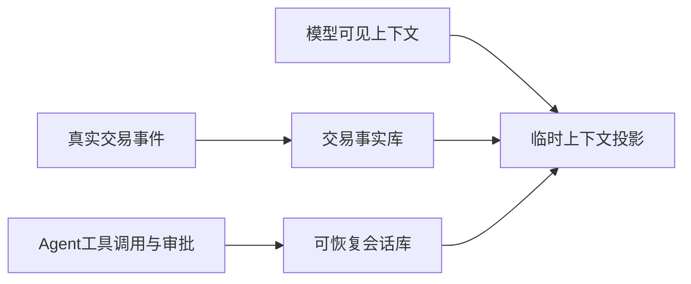
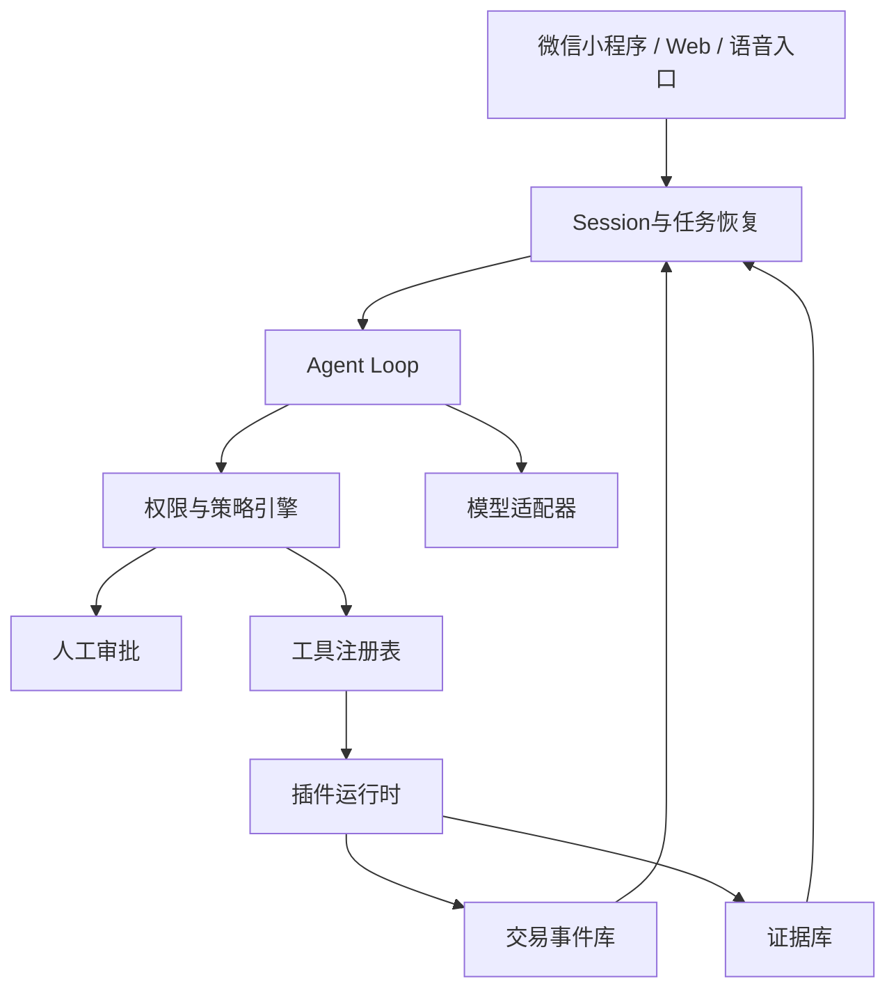

# Agri Harness技术架构

## 1. 目标

Agri Harness不是一个大模型聊天界面，而是农产品交易AI的运行与约束层。

它需要同时回答六个问题：

1. AI在当前任务中能够看到什么；
2. AI可以调用哪些工具；
3. 哪些动作允许自动执行；
4. 哪些动作必须由人确认；
5. 中断、失败或更换模型后如何恢复；
6. 如何替换插件和服务商而不破坏交易事实。

## 2. 三条彼此分离的记录线

系统不能把聊天记录、AI运行过程和交易事实混在一起。



### 2.1 交易事实线

保存要约、订单、支付回执、集货、发货、签收、退款和争议结果。只允许追加事件，不允许AI覆盖历史。

这是跨模型、跨应用、跨服务商迁移时必须保留的权威记录。

### 2.2 Agent执行线

保存一次任务中AI看到了什么、调用了什么工具、收到什么返回、触发什么审批、为什么失败以及怎样恢复。

它用于审计和排错，但不自动成为交易事实。

### 2.3 模型上下文线

模型只读取完成当前步骤所需的投影。上下文可以裁剪、压缩和重新生成，不具有交易权威性。

## 3. 核心组件



### 3.1 Model Adapter

提供模型无关接口，至少支持：

- 文本与图片输入；
- 结构化输出；
- 工具调用；
- 流式响应；
- 可配置超时和重试；
- 本地模型或不同云模型切换；
- 每次调用的模型、版本、费用和延迟记录。

模型适配器不直接拥有业务数据，也不直接写订单状态。

### 3.2 Agent Loop

一次任务由多个Step组成。每个Step包含：

```text
构建上下文
→ 请求模型
→ 解析工具调用
→ 权限检查
→ 必要时等待人工确认
→ 执行工具
→ 保存结果
→ 判断继续、完成或失败
```

并行工具可以并行执行，但写入会话和交易事件时必须保持确定顺序。

### 3.3 Session

Session是可恢复任务的脊柱，至少保存：

- 任务发起者和代理身份；
- 当前目标；
- 意图包版本；
- 已调用工具；
- 工具结果摘要与原始结果位置；
- 审批请求和审批人；
- 错误与重试；
- 关联订单和批次；
- 当前完成状态。

Session允许恢复和分叉，但分叉会话不能修改已经完成的交易事实。

### 3.4 Policy Engine

策略引擎使用确定性规则，不依赖大模型临场判断。

规则示例：

```text
IF 报价低于农户底价 THEN 必须农户确认
IF 退款金额超过阈值 THEN 双人审批
IF 收款账户发生变化 THEN 冻结自动交易并人工复核
IF 证据过期 THEN 不得宣称已验证
IF 模型无法引用真实批次 THEN 禁止生成确定性质量结论
```

### 3.5 Approval

审批不是一个通用“确定”按钮，而是包含明确对象的授权事件：

- 批准什么动作；
- 涉及哪个订单、批次或数据；
- 允许的金额和数量；
- 有效期限；
- 是否可以撤销；
- 谁批准；
- 当时展示了哪些风险信息。

### 3.6 Tool Registry

工具必须声明：

- 名称和版本；
- 输入与输出Schema；
- 所需权限；
- 是否会产生外部写操作；
- 是否涉及支付、隐私或食品安全；
- 幂等规则；
- 超时和失败语义；
- 审计字段；
- 插件来源和签名。

## 4. Profile、Preset与Plugin

### 4.1 Profile

Profile决定一个运行进程拥有哪些基础能力。

建议首版提供：

- `village-node-profile`：村级节点、商品批次、订单和集货；
- `buyer-agent-profile`：意图、发现、比较、下单和售后；
- `public-index-profile`：公开要约抓取、查询和快照；
- `audit-profile`：事件审计、推荐凭证验证和迁移检查。

### 4.2 Preset

Preset决定一次会话中的AI具有什么职责和约束。

- `farmer-assistant`：语音建品、库存维护、底价保护；
- `village-operator`：核验、集货、订单协调和售后；
- `consumer-buyer`：多索引发现、比较和支付前确认；
- `canteen-procurement`：批量需求、交付窗口和合同条件；
- `public-auditor`：只读检查，不得发起交易。

### 4.3 Plugin

插件只提供单项能力，不获得系统全权。

首版插件类型：

- 模型插件；
- 商品识别插件；
- 节点发现插件；
- 物流报价插件；
- 支付跳转插件；
- 检测凭证插件；
- 通知插件；
- 售后分类插件；
- 数据导出插件。

插件卸载时，监听、临时资源和权限必须一并回收。插件不得把自己的私有标识写成不可迁移的业务主键。

## 5. 村级节点的运行边界

村级节点是供给侧最终技术节点，但不是唯一事实来源。

节点可以确认：

- 农户与本村的现实关系；
- 商品批次确实登记；
- 集货和发货是否在本村发生；
- 售后协商是否被执行。

节点不能单独确认：

- 商品绝对安全；
- 检测材料永远真实；
- 物流问题一定由农户负责；
- 消费者必须购买哪个商品。

身份撤销、收款账户修改、大额退款和严重失信声明必须触发复核。

## 6. 标准工具集

### 6.1 只读工具

- `search_public_offers`
- `get_product_batch`
- `get_evidence_summary`
- `get_shipping_quote`
- `get_order_status`
- `verify_recommendation_receipt`

### 6.2 低风险写工具

- `save_draft_batch`
- `update_draft_offer`
- `create_inquiry`
- `save_shopping_list`

### 6.3 高风险工具

- `publish_offer`
- `accept_order`
- `create_payment_session`
- `change_payout_account`
- `approve_refund`
- `revoke_identity_credential`

高风险工具必须经过策略引擎，并根据动作类型触发单人或双人审批。

## 7. 推荐凭证

消费者AI每次给出交易候选时，必须同时生成推荐凭证：

- 查询过的索引；
- 候选集合摘要；
- 硬性过滤条件；
- 排序权重；
- 排除对象和原因；
- 数据时间；
- 不确定性；
- 商业关系；
- 使用的模型和代理版本。

推荐文字可以由模型生成，候选集合和排序结果必须由确定性程序产生。

## 8. 可观察、可恢复、可约束、可替换、可验证

### 可观察

用户能够查看关键工具调用、数据来源、审批和错误，不要求公开模型内部推理过程。

### 可恢复

模型超时、应用关闭、节点离线后，可以从最后一个已提交事件继续。

### 可约束

权限落实到工具、数据对象、金额、期限和审批人，而不是只写在提示词里。

### 可替换

模型、索引、插件、物流、支付适配器和托管服务均有稳定接口与迁移测试。

### 可验证

所有公开兼容实现运行同一套协议样例、一致性测试、退出演练和威胁场景。

## 9. 实施原则

首版采用模块化单体，不拆分微服务。运行边界先写进模块和接口，只有负载、组织或安全要求真正出现时再拆服务。

首版不使用区块链，不自动支付，不建立统一信用分，不训练自有基础模型，也不建设全国统一仓配。
